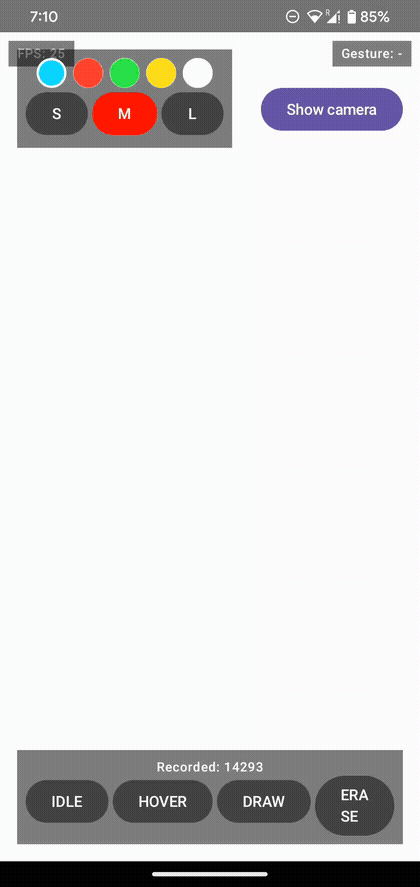
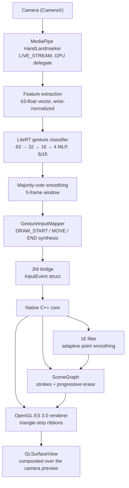
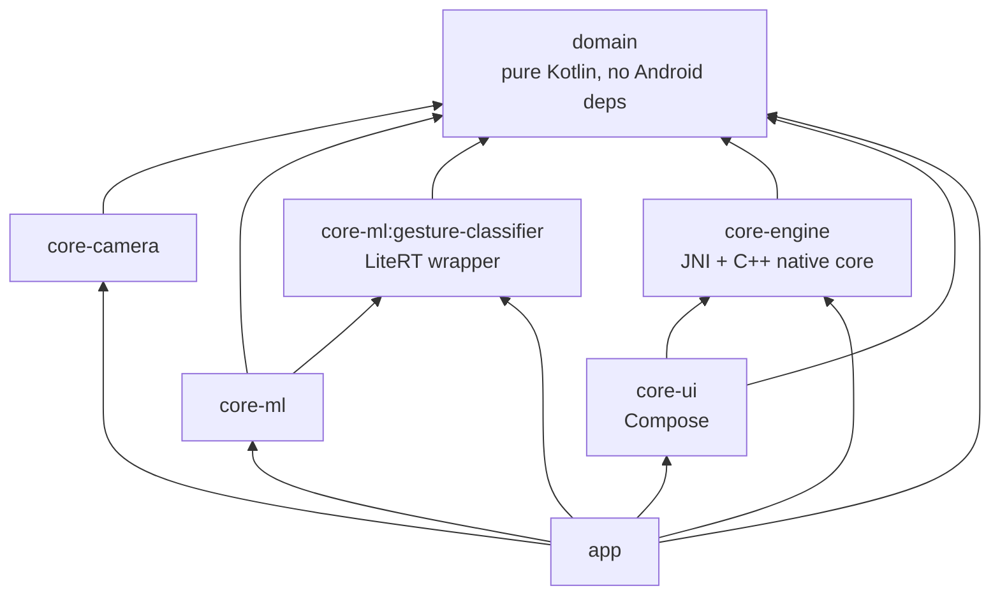

# GestureControl

A gesture-driven drawing canvas for Android: raise a hand in front of the camera, pinch to draw, hold up two fingers to erase — no touch input at all. An on-device ML pipeline (MediaPipe → a custom-trained LiteRT classifier) drives a hand-written C++/OpenGL native rendering core, wired together over JNI.



*(Full-quality video: [media/demo.mp4](media/demo.mp4).)*

## What it does

- Tracks a hand via MediaPipe's `HandLandmarker` and classifies its pose every frame into one of four gestures — `IDLE`, `HOVER`, `DRAW`, `ERASE` — using a small custom-trained neural net, not hardcoded heuristics.
- Pinch (thumb + index together) to draw; the stroke follows your fingertip and renders live, in native OpenGL ES, directly over the camera feed.
- Hold up your index and middle fingers together to erase — and it erases like a real eraser: only the part of the stroke actually under your fingers is removed, splitting a line into separate pieces rather than deleting the whole curve.
- Works with either hand.
- Pick a brush color and line width from on-screen controls.
- A built-in data-collection mode lets you record your own gesture examples straight from the app — the same tooling used to train the bundled model.

## Architecture



The dividing line that makes this tractable: **the native core only ever sees `InputEvent { x, y, state, pressure, timestamp_ms }`.** It has no idea the input came from a camera and a hand-pose classifier rather than a touchscreen or a mouse — the rendering core stays simple and swappable because it's never coupled to where the input actually comes from.

### Module structure (Clean Architecture)



`domain` and `core-ml`'s feature-extraction logic are Android-framework-free by design, ahead of a possible future Kotlin Multiplatform port. `core-engine`'s Kotlin side is a thin external-fun wrapper — all real logic (scene graph, smoothing, rendering) lives in C++, verified independently of the JNI boundary.

## The ML pipeline, with real numbers

- **Landmarker:** MediaPipe `HandLandmarker`, Tasks API, `RunningMode.LIVE_STREAM`, GPU delegate.
- **Feature vector:** all 21 hand landmarks (x, y, z) translated relative to the wrist and scaled by the wrist→middle-finger-MCP distance, giving a 63-float vector that's invariant to hand size and distance from the camera.
- **Classifier:** a small MLP — `63 → Dense(32, ReLU) → Dense(16, ReLU) → Dense(4) → Softmax` — trained in Colab, exported to LiteRT with fp16-quantized weights. The bundled model is **8,164 bytes**.
- **Training data:** 12,800 self-recorded examples across the four classes (DRAW 3,063 / ERASE 3,195 / HOVER 3,164 / IDLE 3,378), covering both hands and multiple recording sessions with varied lighting and hand distance.
- **Smoothing:** majority-vote debounce over the last 5 classified frames before a gesture state change is treated as real, plus a separate 1€ filter (Casiez et al.) smoothing the drawn point positions themselves — chosen over a flat exponential moving average specifically because it adapts: heavy smoothing while the hand is nearly still, minimal added lag during a fast stroke.
- **Runtime:** LiteRT `CompiledModel` API, CPU accelerator — runs via the XNNPACK delegate on-device.

The ERASE gesture was actually redesigned mid-project: the first version (a loose fist) turned out to sit too close to the DRAW pinch shape in feature space and was hard to hold comfortably. It was replaced with two fingers held together, which is both geometrically farther from the pinch pose and more ergonomic — and required fully re-recording that class's training data rather than blending the two gesture shapes under one label.

## The native core

- **CMake + NDK**, building a single `gesture_canvas_core` shared library for `arm64-v8a` and `armeabi-v7a`.
- **EGL context** owned directly by the native side, bound to the `Surface` passed in from Kotlin — not delegated to `GLSurfaceView`'s own renderer thread, so the render loop can be driven explicitly (via `Choreographer`) independent of where input arrives from.
- **Threading:** MediaPipe's result callback and the render loop run on different threads; `nativeSubmitInput` pushes onto a mutex-guarded queue that's drained once per frame from `nativeRenderFrame`, the only place it's consumed.
- **Rendering:** strokes are triangle-strip ribbons (`GL_TRIANGLE_STRIP`), not `GL_LINES`, so they get real width instead of hairline 1px segments, composited over the camera feed with alpha blending.
- **Erase** works at the point level: it trims only the points under the eraser and splits a stroke into separate pieces if the erased section is in the middle — not a naive "delete the whole curve if it's nearby" pass.

## Testing

TDD throughout, not retrofitted: **67 tests**, all passing.

- **43 Kotlin unit tests** (JUnit 5) across `domain` and `core-ml` — feature normalization, viewport/crop mapping, gesture smoothing, gesture-to-input-event mapping — run on the JVM, no emulator needed.
- **24 GoogleTest tests** for the C++ core (`scene/`, `render/`, `input/`), built and run completely independently of the Android/Gradle build via a host-side CMake project (`core-engine/src/test/cpp`) — the same scene graph, ribbon tessellation, and smoothing-filter logic that ships on-device, verified on the host machine in milliseconds.
- Thin framework-glue code (CameraX wiring, the MediaPipe analyzer, the JNI marshaling layer) is intentionally not unit tested — it's verified by running on a physical device instead, which is where the real risk in that kind of code actually lives.

## Performance

Sustains **24–25 fps** on a physical Pixel 4 for the full pipeline running concurrently: camera capture, MediaPipe hand tracking, gesture classification, and native OpenGL rendering with point smoothing. That's up from an initial **9–10 fps** — fixed by moving hand tracking onto the GPU delegate, giving CameraX's analysis use case its own dedicated executor thread, and bounding the analysis resolution to 640×480 rather than the sensor's native resolution.

## Getting started

```bash
git clone <this-repo>
cd GestureControl
./gradlew assembleDebug
```

Requires a physical Android device (API 26+) with a front-facing camera — the emulator's GPU support is generally insufficient for MediaPipe's GPU delegate. Install with:

```bash
./gradlew installDebug
```

To run the tests:

```bash
./gradlew test                                              # 43 Kotlin unit tests
cmake -S core-engine/src/test/cpp -B core-engine/build/host-tests
cmake --build core-engine/build/host-tests
./core-engine/build/host-tests/gesture_canvas_core_tests      # 24 GoogleTest tests
```

## Tech stack

| Layer | Choice |
|---|---|
| Language | Kotlin 2.4, C++20 |
| UI | Jetpack Compose, Compose BOM 2026.06.00 |
| Camera | CameraX 1.5.1 |
| Hand tracking | MediaPipe Tasks Vision 0.10.29 |
| On-device inference | LiteRT (formerly TFLite) 2.1.5 |
| Native build | CMake 3.31.6, NDK 29 |
| Logging | Timber |
| Testing | JUnit 5, MockK, Turbine, GoogleTest |
| Formatting | Spotless + ktlint, enforced via a pre-commit hook |
| Build | AGP 9.3.0, Gradle version catalogs |
