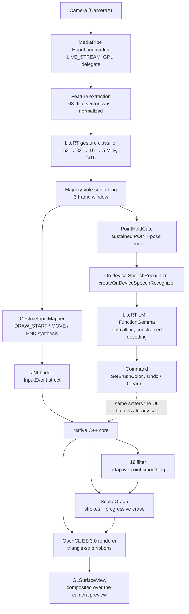
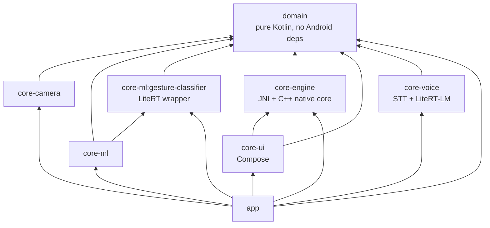

# GestureControl

A gesture-driven drawing canvas for Android: raise a hand in front of the camera, pinch to draw, hold up two fingers to erase, hold a point pose and speak a command — no touch input at all. An on-device ML pipeline (MediaPipe → a custom-trained LiteRT classifier) drives a hand-written C++/OpenGL native rendering core, wired together over JNI, with a second on-device LLM pipeline (LiteRT-LM) layered on top for voice commands.


*(Full-quality video: [media/demo.mp4](media/demo.mp4).)*

## What it does

- Tracks a hand via MediaPipe's `HandLandmarker` and classifies its pose every frame into one of five gestures — `IDLE`, `HOVER`, `DRAW`, `ERASE`, `POINT` — using a small custom-trained neural net, not hardcoded heuristics.
- Pinch (thumb + index together) to draw; the stroke follows your fingertip and renders live, in native OpenGL ES, directly over the camera feed, smoothed with Catmull-Rom path subdivision and MSAA so fast strokes stay smooth instead of faceted.
- Hold up your index and middle fingers together to erase — and it erases like a real eraser: only the part of the stroke actually under your fingers is removed, splitting a line into separate pieces rather than deleting the whole curve.
- Works with either hand.
- Pick a brush color and line width from snapping carousel pickers; hover your fingertip over a carousel's edge for a beat to step through it hands-free.
- A draggable, pinch-resizable picture-in-picture camera preview lets you see your own hand while drawing, without it blocking the canvas underneath.
- Undo and redo, one step per finished stroke or whole erase gesture rather than per input frame — a brief gesture-classification hiccup that splits one continuous line into several strokes still only costs one undo.
- Save the drawing as a PNG and share it, or clear the whole canvas in one tap (behind a confirmation — this is a hard reset, wiping the undo/redo history along with the drawing, so the Undo/Redo buttons correctly go dark afterward instead of offering to restore something that was just deliberately thrown away).
- A built-in data-collection mode lets you record your own gesture examples straight from the app — the same tooling used to train the bundled model.
- Hold a `POINT` pose (index finger extended, static) and speak a command — "change the color to red," "undo," "clear the canvas" — for a touchless voice-command layer running entirely on-device via a second LLM. Say "start listening" to switch to hands-free continuous mode (no more `POINT` needed per command) and "stop listening" to switch back.

## Architecture



The dividing line that makes this tractable: **the native core only ever sees `InputEvent { x, y, state, pressure, timestamp_ms }`.** It has no idea the input came from a camera and a hand-pose classifier rather than a touchscreen or a mouse — the rendering core stays simple and swappable because it's never coupled to where the input actually comes from. Voice commands deliberately don't join that stream at all — a `Command` is a discrete action (a setter call), not stroke input, so it's kept on its own path (dashed above) that happens to call the same setters the on-screen buttons do, rather than being shoehorned into `InputEvent`.

### Module structure (Clean Architecture)



`domain` and `core-ml`'s feature-extraction logic are Android-framework-free by design, ahead of a possible future Kotlin Multiplatform port. `core-engine`'s Kotlin side is a thin external-fun wrapper — all real logic (scene graph, smoothing, rendering) lives in C++, verified independently of the JNI boundary.

## The ML pipeline, with real numbers

- **Landmarker:** MediaPipe `HandLandmarker`, Tasks API, `RunningMode.LIVE_STREAM`, GPU delegate.
- **Feature vector:** all 21 hand landmarks (x, y, z) translated relative to the wrist and scaled by the wrist→middle-finger-MCP distance, giving a 63-float vector that's invariant to hand size and distance from the camera.
- **Classifier:** a small MLP — `63 → Dense(32, ReLU) → Dense(16, ReLU) → Dense(5) → Softmax` — exported to LiteRT with fp16-quantized weights. The bundled model is **8,440 bytes**.
- **Training data:** 10,567 self-recorded examples (exact duplicates removed) across the five classes (IDLE 2,188 / HOVER 2,115 / DRAW 2,406 / ERASE 2,488 / POINT 1,370), covering both hands and multiple recording sessions with varied lighting and hand distance.
- **Train your own:** the app's Data collection mode records labeled examples straight from your own hand (with live per-hand progress tracking and a one-tap reset), and [ml/train.py](ml/train.py) reproduces this exact training/export pipeline locally — see [ml/README.md](ml/README.md).
- **Smoothing:** majority-vote debounce over the last 3 classified frames before a gesture state change is treated as real, plus a separate 1€ filter (Casiez et al.) smoothing the drawn point positions themselves — chosen over a flat exponential moving average specifically because it adapts: heavy smoothing while the hand is nearly still, minimal added lag during a fast stroke.
- **Runtime:** LiteRT `CompiledModel` API, CPU accelerator — runs via the XNNPACK delegate on-device.

The ERASE gesture was actually redesigned mid-project: the first version (a loose fist) turned out to sit too close to the DRAW pinch shape in feature space and was hard to hold comfortably. It was replaced with two fingers held together, which is both geometrically farther from the pinch pose and more ergonomic — and required fully re-recording that class's training data rather than blending the two gesture shapes under one label.

POINT followed a similar arc, but the lesson was about naming rather than feature space: it started life as `FLING`, pitched as a fast lateral swipe to step through the brush color/size carousels hands-free. The classifier recognized the pose fine, but direction had to be inferred from a handful of fingertip positions right before the pose registered, which proved too unreliable in practice (confirmed reversed on one carousel during on-device testing). Carousel navigation was rebuilt on dwell-based edge hovering instead — pure cursor position, no classification involved. Since the underlying pose was never actually a swipe — it's a static index-finger point, not a motion — the class was renamed to `POINT` to match what it actually is, and stayed trained and recognized (shown via its own cursor icon) with no real job for a while, kept on the bet that a genuine static-pose signal would eventually be useful.

It was: `POINT`, held for a sustained ~500ms (`PointHoldGate`), is exactly the touchless push-to-talk trigger Phase 2's voice commands needed — deliberate enough not to fire by accident, and consistent with the "no touch input at all" pitch in a way an on-screen button never could be. A gesture that got renamed for honesty rather than removed turned out to be worth keeping.

## Voice commands, with real numbers

- **Activation:** hold `POINT` for ~500ms (`PointHoldGate`, a timer distinct from the gesture classifier's own 3-frame flicker debounce) to open a single-command listening window, or say "start listening" while activated to switch to continuous mode — no gesture needed per command until "stop listening" switches back. A small state machine (`VoiceActivationController`, `Idle` / `SingleShotListening` / `ContinuousListening`) owns this, remembering which mode a `POINT`-triggered interruption should return to afterward.
- **Speech-to-text:** Android's built-in `createOnDeviceSpeechRecognizer` (API 33+) — forced on-device, no cloud fallback, no model of its own to bundle.
- **Intent classification:** [LiteRT-LM](https://developers.google.com/edge/litert-lm) running a FunctionGemma-class model (~289MB, `litert-community/functiongemma-270m-ft-mobile-actions`) with native tool-calling — one `@Tool`-annotated Kotlin method per command (`setBrushColor`, `undo`, `setContinuousListening`, ...), so the model either calls exactly one (schema-validated by constrained decoding) or none at all. No tool call is the `Unrecognized` fallback, handled the same as a low-confidence result: no command executes, nothing crashes.
- **Command set:** brush color, brush size, undo, redo, clear (routes through the same tap-to-confirm dialog as the trash button — a misheard destructive command still needs a confirming tap), save, start/stop continuous listening.
- **Orchestration:** the listen → classify sequencing lives in `VoiceActivationOrchestrator` (`core-voice`), decoupled from the app layer specifically so it's unit-testable with mocked collaborators (MockK) rather than only verifiable on-device — applying a recognized command, updating UI, and advancing the state machine stay app-layer concerns kept out of it.
- Unlike the 8KB gesture classifier, this model is **not** bundled as an APK asset or committed to git — it's gated behind Hugging Face's Gemma license and far over GitHub's 100MB file limit. See "Voice commands model setup" below.

**Known limitation, stated plainly:** the mechanism is solid — LiteRT-LM's constrained decoding never produced malformed output across extensive testing, and every recognized command mapped to the exact right typed `Command`, every time. But this specific 270M "mobile-actions" fine-tune, evaluated against this project's custom command vocabulary (not the phone-assistant actions it was fine-tuned on), recognizes intent inconsistently — roughly a third to half of natural phrasings across repeated test runs, with some run-to-run variance on identical input even under greedy decoding. A system instruction with few-shot examples and consolidating near-duplicate tools (one `setContinuousListening(enabled)` instead of two separate start/stop tools) measurably helped without closing the gap. The lesson, consistent with the `mediapipe-litert-pipeline` skill's own findings: a small model fine-tuned for one tool vocabulary doesn't necessarily generalize to a different, custom one — worth knowing before betting a demo on it.

**A real bug this surfaced, not an LLM problem:** the brush-color/size carousel's scroll position was only ever set from the selected value once, at initial composition (`rememberLazyListState(initialFirstVisibleItemScrollOffset = ...)`) — every prior caller (a tap, or the dwell-hover carousel stepper) happened to also move the carousel itself in the same code path, so nothing ever exposed the gap. Voice was the first caller to change the selection from genuinely outside the carousel's own interactions, and the swatch silently stopped tracking it. Fixed with a `LaunchedEffect(selected)` that re-centers the carousel whenever the selection changes for any reason — the kind of one-way-data-flow bug that's easy to ship because every existing test of the feature happens to go through the one path that masked it.

## The native core

- **CMake + NDK**, building a single `gesture_canvas_core` shared library for `arm64-v8a` and `armeabi-v7a`.
- **EGL context** owned directly by the native side, bound to the `Surface` passed in from Kotlin — not delegated to `GLSurfaceView`'s own renderer thread, so the render loop can be driven explicitly (via `Choreographer`) independent of where input arrives from.
- **Threading:** MediaPipe's result callback and the render loop run on different threads; `nativeSubmitInput` pushes onto a mutex-guarded queue that's drained once per frame from `nativeRenderFrame`, the only place it's consumed.
- **Rendering:** strokes are triangle-strip ribbons (`GL_TRIANGLE_STRIP`), not `GL_LINES`, so they get real width instead of hairline 1px segments, composited over the camera feed with alpha blending.
- **Erase** works at the point level: it trims only the points under the eraser and splits a stroke into separate pieces if the erased section is in the middle — not a naive "delete the whole curve if it's nearby" pass.

## Testing

TDD throughout, not retrofitted: **144 tests**, all passing.

- **95 Kotlin unit tests** (JUnit 5) across `domain` (80), `core-ml` (10), and `core-voice` (5) — feature normalization, viewport/crop mapping, gesture smoothing, gesture-to-input-event mapping, the edge-dwell and point-hold timer state machines, the voice-activation state machine, and the STT→LLM orchestration (MockK-mocked collaborators, covering the recognized/unrecognized/capture-failed paths) — run on the JVM, no emulator needed.
- **49 GoogleTest tests** for the C++ core (`scene/`, `render/`, `input/`), built and run completely independently of the Android/Gradle build via a host-side CMake project (`core-engine/src/test/cpp`) — the same scene graph (including snapshot-based undo/redo and the near-continuous-stroke merge), ribbon tessellation (including Catmull-Rom subdivision), and smoothing-filter logic that ships on-device, verified on the host machine in milliseconds.
- Thin framework-glue code (CameraX wiring, the MediaPipe analyzer, the JNI marshaling layer, `SpeechRecognizerSource`, `VoiceCommandClassifier`) is intentionally not unit tested — it's verified by running on a physical device instead, which is where the real risk in that kind of code actually lives. Only the pure sequencing logic sitting behind those framework-bound classes (`VoiceActivationOrchestrator`) gets mocked-collaborator unit tests.

## Performance

Sustains **24–25 fps** on a physical Pixel 4 for the full pipeline running concurrently: camera capture, MediaPipe hand tracking, gesture classification, and native OpenGL rendering with point smoothing. That's up from an initial **9–10 fps** — fixed by moving hand tracking onto the GPU delegate, giving CameraX's analysis use case its own dedicated executor thread, and bounding the analysis resolution to 640×480 rather than the sensor's native resolution.

## Getting started

```bash
git clone <this-repo>
cd GestureControl
./gradlew assembleDebug
```

Requires a physical Android device (API 33+ — bumped from API 26+ in Phase 2 for on-device speech recognition) with a front-facing camera and a microphone — the emulator's GPU support is generally insufficient for MediaPipe's GPU delegate. Install with:

```bash
./gradlew installDebug
```

To run the tests:

```bash
./gradlew test                                              # 95 Kotlin unit tests
cmake -S core-engine/src/test/cpp -B core-engine/build/host-tests
cmake --build core-engine/build/host-tests
./core-engine/build/host-tests/gesture_canvas_core_tests      # 49 GoogleTest tests
```

## Voice commands model setup

The voice-command model isn't bundled with the repo (see "Voice commands, with real numbers" above for why) — the app builds and runs fully without it; voice commands simply report unavailable until it's provided (`VoiceCommandClassifier.isModelAvailable()`).

To try voice commands:

1. Accept the Gemma license and download `mobile_actions_q8_ekv1024.litertlm` from Hugging Face: [litert-community/functiongemma-270m-ft-mobile-actions](https://huggingface.co/litert-community/functiongemma-270m-ft-mobile-actions) (the generic CPU/GPU variant — not the `_Google_Tensor_G5` one, which is pre-compiled for Pixel 10-series hardware specifically).
2. Save it as `ml/models/mobile_actions_q8_ekv1024.litertlm` (gitignored — never committed).
3. Run `./gradlew installDebug` as usual. A `pushVoiceModel` task runs automatically afterward, pushing the model to the device's app-external storage if it isn't already there (size-checked, so it's a fast no-op on every install after the first — no separate command to remember, and reinstalling doesn't re-push 280MB every time).

## Tech stack

| Layer | Choice |
|---|---|
| Language | Kotlin 2.4, C++20 |
| UI | Jetpack Compose, Compose BOM 2026.06.00 |
| Camera | CameraX 1.5.1 |
| Hand tracking | MediaPipe Tasks Vision 0.10.29 |
| On-device inference | LiteRT (formerly TFLite) 2.1.5, LiteRT-LM 0.16.0 |
| Voice | Android `SpeechRecognizer` (on-device), FunctionGemma 270M via LiteRT-LM |
| Native build | CMake 3.31.6, NDK 29 |
| Logging | Timber |
| Testing | JUnit 5, MockK, GoogleTest |
| Formatting | Spotless + ktlint, enforced via a pre-commit hook |
| Build | AGP 9.3.0, Gradle version catalogs |

## License

[MIT](LICENSE)
