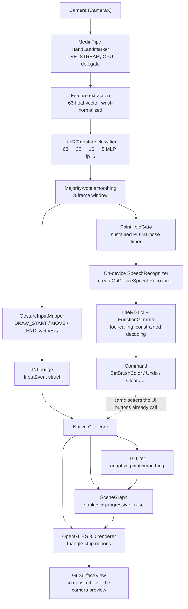
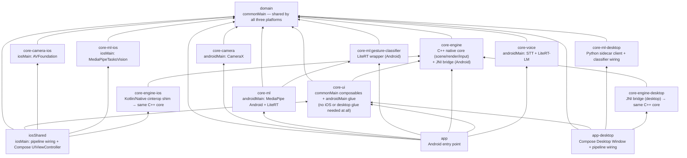

# GestureControl

A gesture-driven drawing canvas, running natively on Android, iOS, *and* desktop (macOS) from one Kotlin Multiplatform codebase: raise a hand in front of the camera, pinch to draw, hold up two fingers to erase, hold a point pose and speak a command — no touch input at all. An on-device ML pipeline (MediaPipe → a custom-trained LiteRT classifier) drives a hand-written C++/OpenGL native rendering core, shared unchanged across all three platforms behind a JNI bridge on Android and desktop, and a Kotlin/Native `cinterop` shim on iOS. Android additionally layers a second on-device LLM pipeline (LiteRT-LM) on top for voice commands (see [Cross-platform (iOS) port](#cross-platform-ios-port) and [Cross-platform (Desktop) port](#cross-platform-desktop-port) for what did and didn't carry over on each).


*(Full-quality video: [media/demo.mp4](media/demo.mp4). iOS and Desktop demos: see [Cross-platform (iOS) port](#cross-platform-ios-port) and [Cross-platform (Desktop) port](#cross-platform-desktop-port).)*

## What it does

- Tracks a hand via MediaPipe's `HandLandmarker` and classifies its pose every frame into one of five gestures — `IDLE`, `HOVER`, `DRAW`, `ERASE`, `POINT` — using a small custom-trained neural net, not hardcoded heuristics.
- Pinch (thumb + index together) to draw; the stroke follows your fingertip and renders live, in native OpenGL ES, directly over the camera feed, smoothed with Catmull-Rom path subdivision and MSAA so fast strokes stay smooth instead of faceted.
- Hold up your index and middle fingers together to erase — and it erases like a real eraser: only the part of the stroke actually under your fingers is removed, splitting a line into separate pieces rather than deleting the whole curve.
- Works with either hand.
- Pick a brush color and line width from snapping carousel pickers; hover your fingertip over a carousel's edge for a beat to step through it hands-free.
- A draggable, pinch-resizable picture-in-picture camera preview lets you see your own hand while drawing, without it blocking the canvas underneath.
- Undo and redo, one step per finished stroke or whole erase gesture rather than per input frame — a brief gesture-classification hiccup that splits one continuous line into several strokes still only costs one undo.
- Save the drawing as a PNG and share it, or clear the whole canvas in one tap (behind a confirmation — this is a hard reset, wiping the undo/redo history along with the drawing, so the Undo/Redo buttons correctly go dark afterward instead of offering to restore something that was just deliberately thrown away).
- A built-in data-collection mode lets you record your own gesture examples straight from the app — the same tooling used to train the bundled model.
- Hold a `POINT` pose (index finger extended, static) and speak a command — "change the color to red," "undo," "clear the canvas" — for a touchless voice-command layer running entirely on-device via a second LLM.

## Architecture



The dividing line that makes this tractable: **the native core only ever sees `InputEvent { x, y, state, pressure, timestamp_ms }`.** It has no idea the input came from a camera and a hand-pose classifier rather than a touchscreen or a mouse — the rendering core stays simple and swappable because it's never coupled to where the input actually comes from. Voice commands deliberately don't join that stream at all — a `Command` is a discrete action (a setter call), not stroke input, so it's kept on its own path (dashed above) that happens to call the same setters the on-screen buttons do, rather than being shoehorned into `InputEvent`.

### Module structure (Clean Architecture, now cross-platform)



`domain` (the feature-extraction/classification/smoothing/input-mapping logic) and `core-ui`'s composables are genuinely shared, unmodified `commonMain` code — not a "ported" copy, the same source compiles and runs on all three targets, same test suite included (see [Testing](#testing)). `core-ui` needed zero platform-specific glue for either iOS or desktop — both entry points wire its composables directly. `core-engine`'s Kotlin side, on every platform, is a thin wrapper — all real logic (scene graph, smoothing, rendering) lives in the C++ core, which is reused byte-for-byte across Android, iOS, *and* desktop; only the bridge into it differs (JNI on Android and desktop, a Kotlin/Native `cinterop` shim on iOS). `core-voice` (STT + LiteRT-LM) has no iOS or desktop target — see each platform's own section below for why.

**Shared code, with real numbers, across all three platforms:** of **4,476 lines** of production Kotlin, **1,503 (~34%)** live in `commonMain` (`domain`: 828, `core-ui`'s composables: 675) and compile unmodified into the Android, iOS, and desktop binaries alike. On top of that, the entire native rendering core — scene graph, point smoothing, ribbon tessellation, **936 lines of C++** — is reused byte-for-byte across all three; it isn't counted in the Kotlin figure since it's linked in through three different thin bridges (229-line JNI glue on Android, a 447-line Obj-C++ shim on iOS, a 198-line JNI bridge on desktop, the last including its own offscreen-FBO management the other two platforms don't need) rather than compiled by Kotlin itself. This is exactly the kind of platform-agnostic core Clean Architecture is supposed to buy — proven a third time, each time with less new code than the last (iOS added 658 platform-specific lines to reach full feature parity; desktop needed 610, despite adding a whole new hand-tracking approach and a real windowing-architecture detour along the way).

## Cross-platform (iOS) port

The whole gesture-drawing loop — camera → hand tracking → gesture classification → smoothing → native rendering — runs the same way on a physical iOS device as on Android, driven by a second, iOS-only `MainViewController` that hosts the same Compose UI chrome as the Android app.

| Layer | Android | iOS |
|---|---|---|
| Camera capture | CameraX | Hand-written `AVCaptureSession` (`core-camera-ios`) — no mature KMP library hands back a raw `CVPixelBuffer` per frame on iOS, every option checked either targets still images or a JPEG-encoded analysis path |
| Hand tracking | MediaPipe Tasks Vision (Android), `LIVE_STREAM`, GPU delegate | MediaPipe Tasks Vision (`MediaPipeTasksVision` xcframework), same `LIVE_STREAM` API, same 21-landmark output shape — **zero retraining needed**: the same `domain`-layer `HandFeatureExtractor` (63-float wrist-normalized vector) and the same trained fp16 classifier weights work on both platforms unmodified |
| Classifier runtime | LiteRT `CompiledModel` reading the bundled `.tflite` file, XNNPACK/CPU | **Deviates from the original plan.** The plan called for the `TensorFlowLiteSwift`/`TensorFlowLiteObjC` LiteRT pods; instead, `domain`'s `GestureMlp` is a ~30-line hand-rolled forward pass (dense → ReLU → dense → ReLU → dense → softmax) over the exact same trained fp16 weights, exported as Kotlin float arrays (`GestureMlpWeights`, `commonMain`) rather than run through an interpreter — no LiteRT iOS runtime dependency at all for this step. It's genuinely shared code (unit-tested identically on both targets, see [Testing](#testing)), just not what was originally planned; Android keeps using the real LiteRT interpreter and hasn't been switched over |
| Rendering | EGL, driven by `Choreographer` | `EAGLContext`, driven by `CADisplayLink` — the *same* C++ ribbon-tessellation/scene-graph code, unchanged, reused via a Kotlin/Native `cinterop` shim instead of JNI |
| Native interop | JNI (`core-engine/src/main/cpp/jni`) | `extern "C"` Objective-C++ shim (`core-engine/src/main/cpp/ios-shim`) + a Kotlin/Native `cinterop` `.def` binding (`core-engine-ios`) — same discipline as the JNI bridge, different binding syntax |
| Voice commands | LiteRT-LM + FunctionGemma, on-device | **Out of scope** — LiteRT-LM's iOS Swift package is still "Early Preview," and its tool-calling support (what Phase 2's voice layer depends on) landed only weeks before this phase started; not a good bet on top of Phase 2's own documented accuracy ceiling on the *mature* Android build |

**What didn't port cleanly, stated plainly:**
- **OpenGL ES is deprecated on iOS** (since iOS 12) but was kept deliberately rather than rewritten in Metal — confirmed still present and compilable on the current SDK, and reusing it kept this phase scoped to what was actually new (KMP interop, camera, MediaPipe) instead of also rewriting the rendering backend. Silenced via `GLES_SILENCE_DEPRECATION`, not ignored.
- **iOS has a smaller feature surface than Android today.** `MainViewController.kt` only wires up `BrushControls`, `FpsLabel`, and `GestureStateLabel` from `core-ui`'s shared composables — the on-canvas gesture-cursor overlay, hand-landmark debug overlay, data-collection mode, and (per above) voice commands all exist in `core-ui`/`app` for Android but aren't wired into the iOS entry point yet. They're shared-code-ready, just not yet plumbed through on the iOS side.
- **A real-device performance investigation, not a code bug.** Real-device testing (Stage 6e) surfaced two genuine bugs along the way — MediaPipe silently falling back to CPU-only inference (no GPU delegate had been set) and the camera's `videoSettings` dictionary silently dropping its pixel-format entry (unboxed CoreFoundation constants, confirmed via real Kotlin type-checking) — both fixed. After those fixes, a periodic multi-second stall remained on one specific physical test device; methodically ruled out lighting, MediaPipe speed, the debug console tunnel, `AVCaptureSession`-level interruptions, thermal state, and Debug-vs-Release builds in turn, before landing on that device's own degraded battery health (75% max capacity) triggering iOS's own peak-power throttling — a subsystem separate from thermal management and invisible to `AVCaptureSession`'s own interruption reporting. Independently confirmed (not just asserted) with a test that drives the identical `LIVE_STREAM` MediaPipe pipeline on the Simulator's unthrottled hardware: 300 sustained submissions, zero multi-second gaps (see [Testing](#testing)).

**Demo:** *(iOS side-by-side recording pending — the Simulator has no camera passthrough for MediaPipe to see a real hand, so this needs a screen recording from the physical device rather than something capturable from this machine alone.)*

## Cross-platform (Desktop) port

The same gesture-drawing loop again, this time on JVM desktop (macOS) via Compose Desktop — a real window, a real webcam, real native OpenGL rendering, no Android or iOS device involved.

| Layer | Android | Desktop |
|---|---|---|
| Camera + hand tracking | CameraX + MediaPipe Tasks Vision (Android), `LIVE_STREAM` | **A local Python subprocess** (`hand-tracking-sidecar/hand_tracking_sidecar.py`) owns both the webcam (`cv2.VideoCapture`) and MediaPipe's real `HandLandmarker`, pinned to `mediapipe==0.10.30` (the newer 1.0.x line hits a real macOS Metal-calculator-service crash, reproduced directly and pinned around), emitting one JSON line of landmarks per frame over stdout to the JVM side (`core-ml-desktop`'s `HandTrackingSidecarClient`) |
| Why a subprocess, not a JVM library | — | MediaPipe's official Java Tasks Vision artifact ships a native `.so` built for Android specifically (confirmed via open, unanswered `google-ai-edge/mediapipe` GitHub issues asking how to build a desktop/JVM version); Google's own docs list exactly four officially supported HandLandmarker platforms — iOS, Android, Web, and Python — desktop C++ isn't one of them. Python was verified directly (not assumed): the same `hand_landmarker.task` file runs cleanly in `LIVE_STREAM` mode, 100/100 async submissions, avg 9.5ms |
| Classifier runtime | LiteRT `CompiledModel` reading the bundled `.tflite` file | **Zero new work** — reuses `domain`'s `GestureMlp` completely unmodified, the same hand-rolled forward pass already built for iOS (see above). The clearest evidence yet that the shared-`commonMain` investment compounds across ports rather than resetting for each new platform |
| Rendering | EGL, driven by `Choreographer` | Real desktop OpenGL 3.3 core profile — **not** GLES-via-ANGLE, the original plan: `google/angle` publishes no prebuilt macOS binaries at all, and its only easy packaging (a Homebrew tap) required trusting an unrelated, unverified third-party tap just to satisfy a listed build dependency, declined outright. `GLCompat.h` (shared with Android/iOS) grew a real desktop-macOS branch instead, providing the different GLSL version pragma real desktop OpenGL needs — `StrokeRenderer.cpp`'s C++ *math* is still reused completely unchanged, only its shader *text* has a second variant |
| Rendering surface | `GLSurfaceView` | **Not** a directly-embedded live GL surface — `org.lwjglx:lwjgl3-awt`'s `AWTGLCanvas` (a separate community project from LWJGL core, not `org.lwjgl:lwjgl-opengl`) is kept off-screen purely to own a context; every frame renders into an offscreen FBO (`nativeRendererCreateOffscreenTarget`) and the captured pixels are shown via a plain Compose `Image`. Real cost, stated plainly: a per-frame CPU pixel-readback-and-reupload round trip instead of Android/iOS's direct hardware-composited surface — see below for why |
| Native interop | JNI (`core-engine/src/main/cpp/jni`) | JNI again (`core-engine-desktop`) — the *same* mechanism, unlike iOS which needed a whole new binding technology (`cinterop`) because Kotlin/Native has no first-class C++ interop |
| Voice commands | LiteRT-LM + FunctionGemma, on-device | **Out of scope**, same reasoning as iOS — no JVM/desktop LiteRT-LM package |

**What didn't port cleanly, stated plainly:**
- **Hand tracking is a genuine architectural deviation, not a clean port.** Every other platform-specific piece in this project is native Kotlin/C++; desktop hand tracking is a bundled Python process instead, because that's the only approach that's both real and low-risk here (see the table row above). The bundling story is settled pragmatically for now too — a pinned venv (`hand-tracking-sidecar/requirements.txt`, gitignored the same way `ml/venv` already is), not a frozen/PyInstaller-style standalone build; that's a real, deferred distribution concern, not a solved one.
- **Real bugs surfaced by live testing, not assumed correct from a clean build.** Drawing initially tracked the mirror image of the real hand — both in position and in MediaPipe's own handedness label — because macOS's built-in webcam (AVFoundation) delivers an already-mirrored frame for front-facing cameras, unlike Android/iOS's own camera analysis streams; fixed with a single `cv2.flip` in the sidecar before MediaPipe ever sees the frame. Drawing was also confined to one quarter of the window on a Retina display: `AWTGLCanvas`'s logical-point `width`/`height` were used where the real physical-pixel `framebufferWidth`/`framebufferHeight` (2x on Retina) were needed.
- **`AWTGLCanvas`, being a heavyweight AWT component, always rendered on top of every other Compose element in the window, regardless of code order** — an open, currently-unfixed JetBrains platform limitation (`compose-multiplatform#3739`), not something specific to this app. Confirmed the hard way: `FpsLabel`/`GestureStateLabel`/`BrushControls` were completely invisible and unclickable underneath the live canvas. JetBrains' own documented escape hatch (`compose.interop.blending`) was tried directly and made things *worse* — a genuine JVM-level crash (SIGSEGV inside `libjvm.dylib` itself), not just an incomplete fix — so it was reverted rather than fought further. The real fix was the architecture change described in the table above (offscreen render + Compose `Image`), which also enabled `GestureCursorOverlay` for free, since it's pure Compose with no heavyweight component of its own to conflict with. A second, unrelated crash (the render `Timer` never stopped, so it kept calling into JNI as the window's GL context was torn down on close) surfaced during the same investigation and got fixed alongside it.
- **Desktop has a smaller feature surface than Android today**, the same honest gap iOS already has — no data-collection mode, hand-landmark debug overlay, or voice commands wired into `app-desktop` yet (the gesture-cursor overlay above *is* wired in), even though the underlying shared code is ready for all but the last.

**Demo:** *(pending a screen recording of the desktop app — same "needs a physical capture, not something scriptable from this machine alone" situation as iOS.)*

## The ML pipeline, with real numbers

- **Landmarker:** MediaPipe `HandLandmarker`, Tasks API, `RunningMode.LIVE_STREAM`, GPU delegate.
- **Feature vector:** all 21 hand landmarks (x, y, z) translated relative to the wrist and scaled by the wrist→middle-finger-MCP distance, giving a 63-float vector that's invariant to hand size and distance from the camera.
- **Classifier:** a small MLP — `63 → Dense(32, ReLU) → Dense(16, ReLU) → Dense(5) → Softmax` — exported to LiteRT with fp16-quantized weights. The bundled model is **8,440 bytes**.
- **Training data:** 10,567 self-recorded examples (exact duplicates removed) across the five classes (IDLE 2,188 / HOVER 2,115 / DRAW 2,406 / ERASE 2,488 / POINT 1,370), covering both hands and multiple recording sessions with varied lighting and hand distance.
- **Train your own:** the app's Data collection mode records labeled examples straight from your own hand (with live per-hand progress tracking and a one-tap reset), and [ml/train.py](ml/train.py) reproduces this exact training/export pipeline locally — see [ml/README.md](ml/README.md).
- **Smoothing:** majority-vote debounce over the last 3 classified frames before a gesture state change is treated as real, plus a separate 1€ filter (Casiez et al.) smoothing the drawn point positions themselves — chosen over a flat exponential moving average specifically because it adapts: heavy smoothing while the hand is nearly still, minimal added lag during a fast stroke.
- **Runtime:** LiteRT `CompiledModel` API, CPU accelerator — runs via the XNNPACK delegate on-device.

The ERASE gesture was actually redesigned mid-project: the first version (a loose fist) turned out to sit too close to the DRAW pinch shape in feature space and was hard to hold comfortably. It was replaced with two fingers held together, which is both geometrically farther from the pinch pose and more ergonomic — and required fully re-recording that class's training data rather than blending the two gesture shapes under one label.

POINT followed a similar arc, but the lesson was about naming rather than feature space: it started life as `FLING`, pitched as a fast lateral swipe to step through the brush color/size carousels hands-free. The classifier recognized the pose fine, but direction had to be inferred from a handful of fingertip positions right before the pose registered, which proved too unreliable in practice (confirmed reversed on one carousel during on-device testing). Carousel navigation was rebuilt on dwell-based edge hovering instead — pure cursor position, no classification involved. Since the underlying pose was never actually a swipe — it's a static index-finger point, not a motion — the class was renamed to `POINT` to match what it actually is, and stayed trained and recognized (shown via its own cursor icon) with no real job for a while, kept on the bet that a genuine static-pose signal would eventually be useful.

It was: `POINT`, held for a sustained ~500ms (`PointHoldGate`), is exactly the touchless push-to-talk trigger Phase 2's voice commands needed — deliberate enough not to fire by accident, and consistent with the "no touch input at all" pitch in a way an on-screen button never could be. A gesture that got renamed for honesty rather than removed turned out to be worth keeping.

## Voice commands, with real numbers

- **Activation:** hold `POINT` for ~500ms (`PointHoldGate`, a timer distinct from the gesture classifier's own 3-frame flicker debounce) to open a single-command listening window. A small state machine (`VoiceActivationController`, `Idle` / `SingleShotListening`) owns this — deliberately just those two states; an earlier hands-free "continuous listening" mode was cut after live testing showed it added failure surface (a boolean-argument tool the model handled unreliably) without a real benefit over `POINT`-per-command.
- **Speech-to-text:** Android's built-in `createOnDeviceSpeechRecognizer` (API 33+) — forced on-device, no cloud fallback, no model of its own to bundle. Reuses a single `SpeechRecognizer` instance for the app's lifetime rather than recreating one per call; recreating it was silently unreliable in practice (the recognition service doesn't always finish unbinding the previous instance before a new one binds, so results from the second call onward never reached the app).
- **Intent classification:** [LiteRT-LM](https://developers.google.com/edge/litert-lm) running a FunctionGemma-class model (~289MB, `litert-community/functiongemma-270m-ft-mobile-actions`) with native tool-calling — one no-argument `@Tool`-annotated Kotlin method per concrete outcome (`setColorRed`, `setSizeLarge`, `undo`, ...) rather than one tool per category with a string/enum argument, so the model only has to pick the right tool, never extract a value from the transcript. Runs off the main thread (`Dispatchers.Default`) — the blocking native inference call (1.5-2.5s observed) was freezing the UI when left on the composition's default dispatcher.
- **Command set:** brush color, brush size, undo, redo, clear (routes through the same tap-to-confirm dialog as the trash button — a misheard destructive command still needs a confirming tap), save.
- **Orchestration:** the listen → classify sequencing lives in `VoiceActivationOrchestrator` (`core-voice`), decoupled from the app layer specifically so it's unit-testable with mocked collaborators (MockK) rather than only verifiable on-device — applying a recognized command, updating UI, and advancing the state machine stay app-layer concerns kept out of it.
- Unlike the 8KB gesture classifier, this model is **not** bundled as an APK asset or committed to git — it's gated behind Hugging Face's Gemma license and far over GitHub's 100MB file limit. See "Voice commands model setup" below.

**Known limitation, stated plainly:** the mechanism is solid — LiteRT-LM's constrained decoding never produced malformed output, and every *recognized* command mapped to the exact right typed `Command`, every time. But this specific 270M "mobile-actions" fine-tune, evaluated against this project's custom command vocabulary (not the phone-assistant actions it was fine-tuned on), doesn't reliably recognize intent at all. Extensive live, on-device iteration worked through several distinct failure layers in order: an STT recognizer-lifecycle bug (fixed), a UI-thread freeze (fixed), a native rendering bug the voice feature surfaced but didn't cause (fixed) — and then a residual, unfixable layer of the model itself: even after switching every argument-taking tool to a no-argument one per outcome (removing value-extraction entirely, leaving only tool *selection*), and instructing it to call at most one tool per turn, it would still on occasion call multiple unrelated tools in a single turn, or flatly deny having a tool (`undo`, `save`) that was demonstrably present in its own schema. That's not a prompting problem to iterate further on — it's the model pattern-matching against its original fine-tuning vocabulary instead of the schema it's actually been given. Documented here rather than chased further; see the `litert-lm-tool-calling` skill for the general lesson.

**Real bugs this surfaced, not LLM problems:**
- The brush-color/size carousel's scroll position was only ever set from the selected value once, at initial composition (`rememberLazyListState(initialFirstVisibleItemScrollOffset = ...)`) — every prior caller (a tap, or the dwell-hover carousel stepper) happened to also move the carousel itself in the same code path, so nothing ever exposed the gap. Voice was the first caller to change the selection from genuinely outside the carousel's own interactions. Fixed with a `LaunchedEffect(selected)` that re-centers the carousel whenever the selection changes for any reason.
- A stroke's color and width were captured once, in `SceneGraph::beginStroke`, and never touched again by `extendStroke` — so changing the brush color or size mid-stroke (by voice *or* touch, with a second hand) visibly updated the picker but left the actively-drawing line unchanged until it ended and a new one began. Fixed by updating the in-progress stroke's color/width live in `setBrushColor`/`setBrushSize`, with GoogleTest coverage locking in the new behavior.

## The native core

- **CMake + NDK**, building a single `gesture_canvas_core` shared library for `arm64-v8a` and `armeabi-v7a`.
- **EGL context** owned directly by the native side, bound to the `Surface` passed in from Kotlin — not delegated to `GLSurfaceView`'s own renderer thread, so the render loop can be driven explicitly (via `Choreographer`) independent of where input arrives from.
- **Threading:** MediaPipe's result callback and the render loop run on different threads; `nativeSubmitInput` pushes onto a mutex-guarded queue that's drained once per frame from `nativeRenderFrame`, the only place it's consumed.
- **Rendering:** strokes are triangle-strip ribbons (`GL_TRIANGLE_STRIP`), not `GL_LINES`, so they get real width instead of hairline 1px segments, composited over the camera feed with alpha blending.
- **Erase** works at the point level: it trims only the points under the eraser and splits a stroke into separate pieces if the erased section is in the middle — not a naive "delete the whole curve if it's nearby" pass.

## Testing

TDD throughout, not retrofitted: **154 tests**, all passing across Android, iOS, and desktop.

- **104 Kotlin unit tests.** `domain`'s 73 tests are genuinely cross-platform — the same JUnit-5-style source runs via the JVM test runner on Android *and* desktop and via Kotlin/Native's own test runner on the iOS Simulator, no forking or platform-specific rewriting — covering feature normalization, viewport/crop mapping, gesture smoothing, gesture-to-input-event mapping, and the edge-dwell/point-hold timer state machines. `core-ml` (10) and `core-voice` (5) are Android-only, covering the LiteRT landmark mapping/CSV formatting and the voice-activation state machine plus STT→LLM orchestration (MockK-mocked collaborators). `core-camera-ios` (1), `core-ml-ios` (5), and `core-engine-ios` (4) are iOS-only — proving the AVFoundation session configures, the MediaPipe `LIVE_STREAM` landmarker actually constructs against both the CPU and GPU delegate paths, and the EAGL renderer produces correct pixels through the `cinterop` bridge (`RendererBridgeTest`). `core-engine-desktop` (2) and `core-ml-desktop` (4) are desktop-only — a real desktop OpenGL context drawing and capturing a correct pixel through both the default framebuffer and the app's actual offscreen-FBO rendering path (`DesktopRendererBridgeTest`), and the sidecar's JSON-to-domain-type mapping handling a missing hand, a malformed frame, and an unrecognized handedness string without crashing (`SidecarFrameTest`).
- **50 GoogleTest tests** for the C++ core (`scene/`, `render/`, `input/`), built and run completely independently of any Gradle build via a host-side CMake project (`core-engine/src/test/cpp`) — the same scene graph (including snapshot-based undo/redo, the near-continuous-stroke merge, and a live mid-stroke color/size update), ribbon tessellation (including Catmull-Rom subdivision), and smoothing-filter logic that ships on **all three** platforms, verified once on the host machine in milliseconds rather than three times on-device.
- **This discipline caught a real regression, not a hypothetical one:** making MediaPipe's GPU delegate unconditional (a genuine real-device performance fix, see [Cross-platform (iOS) port](#cross-platform-ios-port)) broke `IosLiveHandLandmarkerTest` on the Simulator outright — Metal's software renderer there can't actually initialize an inference delegate, a `RET_CHECK` failure the test caught immediately, before it ever reached a device. Fixed by detecting the Simulator at runtime (`SIMULATOR_DEVICE_NAME`) and falling back to CPU there.
- Thin framework-glue code (CameraX/AVFoundation wiring, the MediaPipe analyzer, the JNI/cinterop marshaling layers, `SpeechRecognizerSource`, `VoiceCommandClassifier`) is intentionally not unit tested on any platform — it's verified by running on a physical device instead, which is where the real risk in that kind of code actually lives. Only the pure sequencing logic sitting behind those framework-bound classes (`VoiceActivationOrchestrator`) gets mocked-collaborator unit tests. `LiveHandLandmarkerSustainedThroughputTest` (`core-ml-ios`) is the one exception worth calling out by name: it drives MediaPipe's real `LIVE_STREAM` engine end-to-end on Simulator hardware specifically to give an independently reproducible answer to a real-device question ("is a stall the pipeline's fault, or the device's?") rather than one more mocked unit test.

## Performance

Sustains **24–25 fps** on a physical Pixel 4 for the full pipeline running concurrently: camera capture, MediaPipe hand tracking, gesture classification, and native OpenGL rendering with point smoothing. That's up from an initial **9–10 fps** — fixed by moving hand tracking onto the GPU delegate, giving CameraX's analysis use case its own dedicated executor thread, and bounding the analysis resolution to 640×480 rather than the sensor's native resolution.

## Getting started

```bash
git clone <this-repo>
cd GestureControl
./gradlew assembleDebug
```

Requires a physical Android device (API 33+ — bumped from API 26+ in Phase 2 for on-device speech recognition) with a front-facing camera and a microphone — the emulator's GPU support is generally insufficient for MediaPipe's GPU delegate. Install with:

```bash
./gradlew installDebug
```

### iOS

```bash
./gradlew :iosShared:linkDebugFrameworkIosArm64   # builds the KMP framework for a physical device
cd iosApp && xcodegen generate                    # regenerates GestureControlApp.xcodeproj from project.yml
open GestureControlApp.xcodeproj
```

Select your own team under Signing & Capabilities (the repo doesn't — and shouldn't — commit anyone's signing identity), then build and run on a **physical device**. Like Android, this needs the real camera: the iOS Simulator has no camera passthrough, so MediaPipe never receives real frames there — Simulator runs are useful for the test suite (below) and for `HandLandmarker`/renderer-construction checks, not for actually seeing the gesture pipeline draw anything.

### Desktop (macOS)

```bash
python3 -m venv hand-tracking-sidecar/venv
source hand-tracking-sidecar/venv/bin/activate
pip install -r hand-tracking-sidecar/requirements.txt
deactivate
./gradlew :app-desktop:run
```

The venv is a one-time setup step (gitignored, like `ml/venv`), needed because desktop hand tracking runs through a bundled Python subprocess rather than a JVM library — see [Cross-platform (Desktop) port](#cross-platform-desktop-port) for why. The first run prompts for the same one-time camera permission Android/iOS need; on macOS this is tied to whatever process actually launches the JVM (Terminal, an IDE, ...), so grant it to that app specifically if the prompt doesn't appear on its own.

To run the full suite (Android/desktop JVM + iOS Simulator + the shared C++ core, all in one pass — the pre-commit/pre-push hooks only run `spotlessCheck` for speed, so this is a separate, deliberate step, not something enforced automatically on every commit):

```bash
./gradlew test allTests                                        # 104 Kotlin unit tests, JVM (Android + desktop) + iOS Simulator
cmake -S core-engine/src/test/cpp -B core-engine/build/host-tests
cmake --build core-engine/build/host-tests
./core-engine/build/host-tests/gesture_canvas_core_tests        # 50 GoogleTest tests
```

## Voice commands model setup

Android only — see [Cross-platform (iOS) port](#cross-platform-ios-port) and [Cross-platform (Desktop) port](#cross-platform-desktop-port) for why voice isn't part of either other build. The voice-command model isn't bundled with the repo (see "Voice commands, with real numbers" above for why) — the app builds and runs fully without it; voice commands simply report unavailable until it's provided (`VoiceCommandClassifier.isModelAvailable()`).

To try voice commands:

1. Accept the Gemma license and download `mobile_actions_q8_ekv1024.litertlm` from Hugging Face: [litert-community/functiongemma-270m-ft-mobile-actions](https://huggingface.co/litert-community/functiongemma-270m-ft-mobile-actions) (the generic CPU/GPU variant — not the `_Google_Tensor_G5` one, which is pre-compiled for Pixel 10-series hardware specifically).
2. Save it as `ml/models/mobile_actions_q8_ekv1024.litertlm` (gitignored — never committed).
3. Run `./gradlew installDebug` as usual. A `pushVoiceModel` task runs automatically afterward, pushing the model to the device's app-external storage if it isn't already there (size-checked, so it's a fast no-op on every install after the first — no separate command to remember, and reinstalling doesn't re-push 280MB every time).

## Tech stack

| Layer | Choice |
|---|---|
| Language | Kotlin 2.4 (Multiplatform), C++20 |
| UI | Compose Multiplatform, Compose BOM 2026.06.00 |
| Camera (Android) | CameraX 1.5.1 |
| Camera (iOS) | `AVCaptureSession`/`AVCaptureVideoDataOutput`, hand-written (`core-camera-ios`) |
| Camera + hand tracking (desktop) | Python 3.13, `mediapipe` 0.10.30 (pinned — see [Cross-platform (Desktop) port](#cross-platform-desktop-port)), `opencv-python` for `cv2.VideoCapture`, run as a subprocess (`hand-tracking-sidecar/`) |
| Hand tracking (Android) | MediaPipe Tasks Vision 0.10.29 |
| Hand tracking (iOS) | `MediaPipeTasksVision` 1.0.0, vendored as an xcframework (not CocoaPods — fetched and linked directly, see `core-ml-ios/build.gradle.kts`) |
| On-device inference | LiteRT (formerly TFLite) 2.1.5, LiteRT-LM 0.16.0 (Android only) |
| Voice | Android `SpeechRecognizer` (on-device), FunctionGemma 270M via LiteRT-LM — **Android only**, see [Cross-platform (iOS) port](#cross-platform-ios-port) |
| Native build (Android) | CMake 3.31.6, NDK 29 |
| Native build (iOS) | Kotlin/Native `cinterop`, `EAGLContext`/OpenGL ES 3.0, `xcodegen` 2.46.0 |
| Native build (desktop) | JNI (hand-written clang++ Gradle task, no CMake), real desktop OpenGL 3.3 core profile — no ANGLE, see [Cross-platform (Desktop) port](#cross-platform-desktop-port) |
| Desktop windowing/GL | LWJGL 3.4.1 (GLFW, for the headless renderer test), `org.lwjglx:lwjgl3-awt` 0.2.4 (`AWTGLCanvas`, for the real app window) |
| Logging | Timber (Android) |
| Testing | JUnit 5 / Kotlin/Native test runner (shared `commonMain` source, now including a desktop JVM target), MockK, GoogleTest |
| Formatting | Spotless + ktlint, enforced via a pre-commit hook |
| Build | AGP 9.3.0, Gradle version catalogs |

## License

[MIT](LICENSE)
